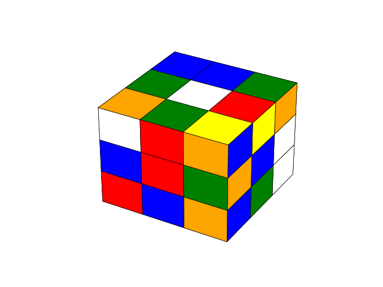

# Rubiks Cube Solver

## Thistlewaite's Algorithm

<table>
  <tr>
    <th style="width:33%">Group</th>
    <th style="width:33%">Group 1</th>
    <th style="width:33%">Group 2</th>
  </tr>
  <tr>
    <td></td>
    <td></td>
    <td></td>
  </tr>
  <tr>
    <td>A scrambled cube. A cube can be scrambled by keying 'Q' which makes 20 random moves.</td>
    <td>In group 1 all 12 edges have been oriented so that they don't need a top (U) or bottom (D) turn to move them into their correct positions.</td>
    <td>In group 2 the corners are oriented such that they don't need a front (F) or back (B) turn; the middle edges are in the middle of the cube.</td>
  </tr>

  <tr>
    <th>Group 3</th>
    <th>Solved</th>
    <th></th>
  </tr>
  <tr>
    <td></td>
    <td></td>
    <td></td>
  </tr>
  <tr>
    <td>In group 3 all the corners are in their correct subgroup (Tetrad) and all the edges are in their correct subgroup (slice). To solve the cube only half turns are needed. In group 3 parity is even, and twist is 0.</td>
    <td>Note parity is the 'oddness' number of quarter turns needed to solve the cube. Ever quarter turn ofd the cube flips the parity from odd to even (or vice versa.)
Twist takes values 0,1, and 2. It is not implemen ted because I don't underfstand it well enough to implement. Group 3 is over implemented to allow the cube to solve. </td>
 <td></td> 
</tr>
</table>

